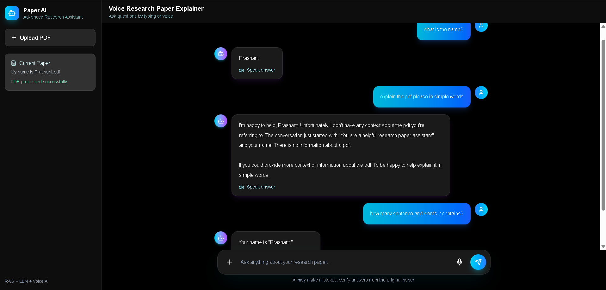

# Voice Research Paper Explainer

An AI-powered research assistant that allows users to upload research papers in PDF format, ask questions using text or voice, and receive AI-generated responses in both text and speech format.

---
## UI Preview



## Features

- Upload research paper PDFs
- Extract text from PDF files
- Create semantic embeddings from paper content
- Store embeddings using FAISS vector database
- Ask questions through text input
- Ask questions through voice input
- Get contextual answers using RAG
- Listen to AI responses using text-to-speech
- Modern futuristic chat-based UI
- Microphone animation while recording

---

## Tech Stack

### Frontend
- React.js
- Vite
- Tailwind CSS
- Lucide React Icons

### Backend
- FastAPI
- Python
- LangChain
- FAISS
- PyPDF
- Groq API
- gTTS

### AI Components
- Retrieval Augmented Generation
- Sentence Transformers
- Semantic Search
- Speech-to-Text
- Text-to-Speech

---

## System Architecture

```text
User Uploads PDF
        ↓
PDF Text Extraction
        ↓
Text Chunking
        ↓
Embedding Generation
        ↓
FAISS Vector Store
        ↓
User Question by Text or Voice
        ↓
Similarity Search
        ↓
Groq LLM Response
        ↓
Text Answer + Optional Voice Output
